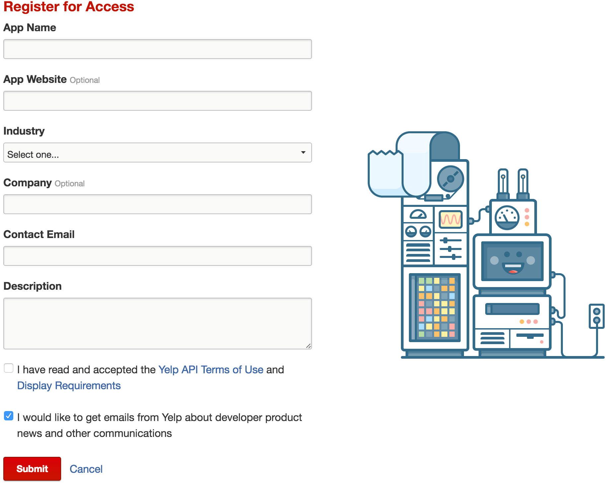
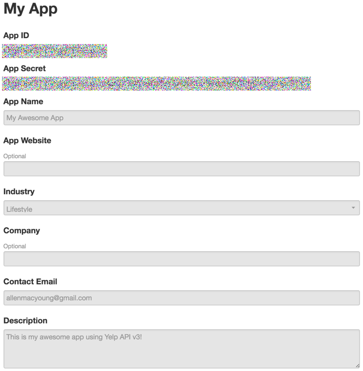

# Get started with Yelp API v3

Yelp API v3 allows you to get best local business information and user reviews of over million businesses in 32 countries. This tutorial provides an overview of the capabilities Yelp API v3 provides, provides instructions of how to authenticate the API calls, and goes through a simple scenario using the API.

## Endpoints

All Yelp API v3 endpoints are under ``https://api.yelp.com/v3``. Following are the ones we provide right now. You can click the links for detailed documentations. You can also try it out by yourself using [Postman](https://www.getpostman.com/).

[](https://app.getpostman.com/run-collection/a54dde1fd81323f2203e)

| Name | Path | Description |
|:-----|:------|:-------------|
| Search | [/businesses/search](../api-references/businesses-search.md) | Search for businesses by keyword, category, location, price level, etc. |
| Phone search | [/businesses/search/phone](../api-references/businesses-search-phone.md) | Search for businesses by phone number. |
| Transaction search | [/transactions/{transaction_type}/search](../api-references/transactions-search.md) | Search for businesses which support certain transactions, such as food delivery and pickup. |
| Business | [/businesses/{id}](../api-references/businesses-id.md) | Get rich business data, such as name, address, phone number, photos, Yelp rating, price levels and hours of operation. |
| Reviews | [/businesses/{id}/reviews](../api-references/businesses-id-reviews.md) | Get up to three review excerpts for a business. |
| Autocomplete | [/autocomplete](../api-references/autocomplete.md) | Provide autocomplete suggestions for businesses, search keywords and categories. |

## Authentication

Yelp API v3 uses [OAuth2](http://oauth.net/2/) for authentication. Currently, only [client credentials](https://tools.ietf.org/html/rfc6749#section-4.4) authorization grant flow is supported. To authenticate the call to an endpoint, there are 3 steps:

1. Create an app with to obtain your client id and secret.
2. Use the client id and secret to get an access token.
3. Authenticate API calls with the access token.

### Create an app on Yelp developers site

In order to set up your access to Yelp API v3, you need to create an app with Yelp. This app represents the application you'll build using Yelp API, with the credentials you need to gain access. Following are the steps.

1. Go to [Yelp developers site](https://www.yelp.com/developers/v3/preview) and click the **Register for Access** button.

2. In the register for access form, enter information about your app accordingly, then agree to Yelp API Terms of Use and Display Requirements. Then click the **Submit** button.

3. Now you should get the client id and secret, which will be used in the next step to get an access token.


> **Note**
> 
> Please keep the client id and secret to yourself since they are credentials for your app to call Yelp API.

### Get an access token

To get an access token, make a **POST** call to the following endpoint using the client id and secret obtained from the former step. Then get the access token from the response body.


**URL**

```
https://api.yelp.com/oauth2/token
```

**Parameters**

These parameters should be sent in ``application/x-www-form-urlencoded`` format in the **POST** call.

| Name | Type | Description |
|:------|:------|:-------------|
| ``grant_type`` | string | The [OAuth2 grant type](https://tools.ietf.org/html/rfc6749#section-1.3) to use. Right now, only ``client_credentials`` is supported. |
| ``client_id`` | string | The client id for you app with Yelp. |
| ``client_secret`` | string | The client secret for you app with Yelp. |

**Response body**

```json
{
  "access_token": "your access token",
  "token_type": "bearer",
  "expires_in": 15552000
}
```

| Name | Type | Description |
|:------|:------|:-------------|
| ``access_token`` | string | The access token which you'll use to access Yelp API v3 endpoints. |
| ``token_type`` | string | The access token type. Always returns ``Bearer``. |
| ``expries_in`` | int | Represents the number of seconds after which this access token will expire. Right now it's always 15552000, which is 180 days. |

### Authenticate API calls with the access token

To authenticate API calls with the access token, set the ``Authorization`` HTTP header value as ``Bearer access_token``.

## Use the API

Let's use a simple scenario to demonstrate how to use Yelp API v3. Imaging you are building an app helping users find great food nearby and you want to provide a search experience.

1. A user enters "del" in the search box.
2. She is provided by a few autocomplete suggestions, like "delivery" and "delis".
3. She chooses "delis" to see what options she has nearby.
4. Then she chooses "delivery" since she figured she doesn't want to go out to get the food.
5. She is offered with all the restaurants which deliver to her location.
6. She chooses one, view the restaurant details and reviews, then makes the decision to order some delivery.

Following is how to use Yelp API v3 to implement this experience.

### Get autocomplete suggestions based on user's input

As the user is typing, you can monitor the user's input and call our autocomplete API at real time. It's always good to also provide the latitude and longitude parameters so that you can get suggestions on businesses as well.

```
GET https://api.yelp.com/v3/autocomplete?text=del&latitude=37.786882&longitude=-122.399972
```

In the response body below, you can see that it's returning suggestions for terms, businesses and categories.

```json
{
  "terms": [
    {
      "text": "Delivery"
    }
  ],
  "businesses": [
    {
      "id": "YqvoyaNvtoC8N5dA8pD2JA",
      "name": "Delfina"
    },
    {
      "id": "vu6PlPyKptsT6oEq50qOzA",
      "name": "Delarosa"
    },
    {
      "id": "bai6umLcCNy9cXql0Js2RQ",
      "name": "Pizzeria Delfina"
    }
  ],
  "categories": [
    {
      "alias": "delis",
      "title": "Delis"
    },
    {
      "alias": "fooddeliveryservices",
      "title": "Food Delivery Services"
    },
    {
      "alias": "couriers",
      "title": "Couriers & Delivery Services"
    }
  ]
}
```

### Search for businesses with a keyword

Once the user selects "delis" from the autocomplete suggestions as the search keyword, you can call the search API to find out restaurants matching the keyword. Again, by providing the latitude and longitude parameters, you'll get the best results which take location into consideration.

```
GET https://api.yelp.com/v3/businesses/search?term=delis&latitude=37.786882&longitude=-122.399972
```

In the response body below, you'll get a list of businesses with valuable information like name, address, phone number, Yelp rating, price levels, review counts, image, etc. The URL of the restaurant points the corresponding Yelp business page. It's smart enough that on a mobile device, it will open the Yelp app (if it's installed) or the Yelp mobile website.

```json
{
  "total": 1316,
  "businesses": [
    {
      "rating": 4.5,
      "price": "$$",
      "phone": "+14154212337",
      "id": "molinari-delicatessen-san-francisco",
      "categories": [
        {
          "alias": "delis",
          "title": "Delis"
        }
      ],
      "review_count": 910,
      "name": "Molinari Delicatessen",
      "url": "https://www.yelp.com/biz/molinari-delicatessen-san-francisco",
      "coordinates": {
        "latitude": 37.7983818054199,
        "longitude": -122.407821655273
      },
      "image_url": "http://s3-media4.fl.yelpcdn.com/bphoto/6He-NlZrAv2mDV-yg6jW3g/o.jpg",
      "location": {
        "city": "San Francisco",
        "country": "US",
        "address2": "",
        "address3": "",
        "state": "CA",
        "address1": "373 Columbus Ave",
        "zip_code": "94133"
      }
    },
    // ...
  ]
}
```

### Search for businesses supporting delivery

Once the user selects "Delivery" from the autocomplete suggestions as the search keyword, you can call the transaction search API to find out businesses which deliver to the user's location. Here the latitude and longitude parameters are required since delivery availability depends on the location of the delivery. You can also pass in a different location to implement the case where the user will take the delivery in a different location.

```
GET https://api.yelp.com/v3/transactions/delivery/search?latitude=37.786882&longitude=-122.399972
```

The response body right now is pretty much the same as search API response body.

```json
{
  "total": 25,
  "businesses": [
    {
      "rating": 4,
      "image_url": "",
      "name": "North India Restaurant",
      "url": "https://www.yelp.com/biz/north-india-restaurant-san-francisco",
      "review_count": 551,
      "coordinates": {
        "latitude": null,
        "longitude": null
      },
      "id": "north-india-restaurant-san-francisco",
      "categories": [
        {
          "alias": "indpak",
          "title": "Indian"
        }
      ]
    },
    // ...
  ]
}
```

### Get business details and reviews

Finally, you can call the business API and reviews API to get business details and up to 3 reviews.

To get business detail information, you can make the following call.

```
GET https://api.yelp.com/v3/businesses/north-india-restaurant-san-francisco
```

In the response body right now, you'll get up to 3 additional photos and hours of the business.

```json
{
  "rating": 4,
  "price": "$$",
  "hours": [
    {
      "hours_type": "REGULAR",
      "open": [
        {
          "is_overnight": false,
          "end": "2300",
          "day": 0,
          "start": "1000"
        },
        {
          "is_overnight": false,
          "end": "2300",
          "day": 1,
          "start": "1000"
        },
        {
          "is_overnight": false,
          "end": "2300",
          "day": 2,
          "start": "1000"
        },
        {
          "is_overnight": false,
          "end": "2300",
          "day": 3,
          "start": "1000"
        },
        {
          "is_overnight": false,
          "end": "0000",
          "day": 4,
          "start": "1000"
        },
        {
          "is_overnight": false,
          "end": "0000",
          "day": 5,
          "start": "1000"
        },
        {
          "is_overnight": false,
          "end": "2300",
          "day": 6,
          "start": "1000"
        }
      ],
      "is_open_now": true
    }
  ],
  "photos": [
    "http://s3-media4.fl.yelpcdn.com/bphoto/howYvOKNPXU9A5KUahEXLA/o.jpg",
    "http://s3-media3.fl.yelpcdn.com/bphoto/I-CX8nioj3_ybAAYmhZcYg/o.jpg",
    "http://s3-media2.fl.yelpcdn.com/bphoto/uaSNfzJUiFDzMeSCwTcs-A/o.jpg"
  ],
  "id": "north-india-restaurant-san-francisco",
  "categories": [
    {
      "alias": "indpak",
      "title": "Indian"
    }
  ],
  "review_count": 551,
  "name": "North India Restaurant",
  "url": "https://www.yelp.com/biz/north-india-restaurant-san-francisco",
  "coordinates": {
    "latitude": 37.787789124691,
    "longitude": -122.399305736113
  },
  "image_url": "https://s3-media1.fl.yelpcdn.com/bphoto/howYvOKNPXU9A5KUahEXLA/o.jpg",
  "location": {
    "city": "San Francisco",
    "country": "US",
    "address2": "",
    "address3": "",
    "state": "CA",
    "address1": "123 Second St",
    "zip_code": ""
  }
}
```

To get reviews of the business, you can make the following call.

```
GET https://api.yelp.com/v3/businesses/north-india-restaurant-san-francisco/reviews
```

In the response body, you can get up to three reviews, including the excerpt, the URL to the full review, the Yelp rating with the review, the name and profile photo of the reviewer.

```json
{
  "reviews": [
    {
      "url": "https://www.yelp.com/biz/north-india-restaurant-san-francisco?hrid=AeVAkQgueu6JtYtU4r3Jrg",
      "text": "This place is really pretty and I really love this place. My friends and me came here yesterday. The food is superb, the service is impeccable (mostly) and...",
      "user": {
        "image_url": "",
        "name": "Hoang V."
      },
      "rating": 5
    },
    {
      "url": "https://www.yelp.com/biz/north-india-restaurant-san-francisco?hrid=6tsz9tl7HAiOcYj_fGrsCg",
      "text": "Went there for the first time Saturday Evening,everything is great, the ambiance is outstanding for this location, tried the mulliatawny soup for starters...",
      "user": {
        "image_url": "http://s3-media2.fl.yelpcdn.com/photo/O1ZuPKBhwxHAT60XZksWHQ/o.jpg",
        "name": "Winston P."
      },
      "rating": 5
    },
    {
      "url": "https://www.yelp.com/biz/north-india-restaurant-san-francisco?hrid=3b3-zDKfomV-1qR3Z0jmQw",
      "text": "I came in here for the $9.95 lunch buffet the day after it opened.  It is the old Tara space and I like how it has been opened up to accommodate many more...",
      "user": {
        "image_url": "http://s3-media1.fl.yelpcdn.com/photo/bQRonQWaxInb7eKAtMjf3A/o.jpg",
        "name": "Ronita J."
      },
      "rating": 4
    }
  ],
  "total": 3
}
```
## What's next

Now you've learned how to use Yelp API v3 to get the best local business information and user reviews. We cannot wait to see the awesome applications you'll build with it.

- To provide feedback or report an issue, please go to https://github.com/Yelp/yelp-api-v3/issues.
- To tell us about your apps and ideas, please email api@yelp.com.
- Check out [FAQ](../others/faq.md).

